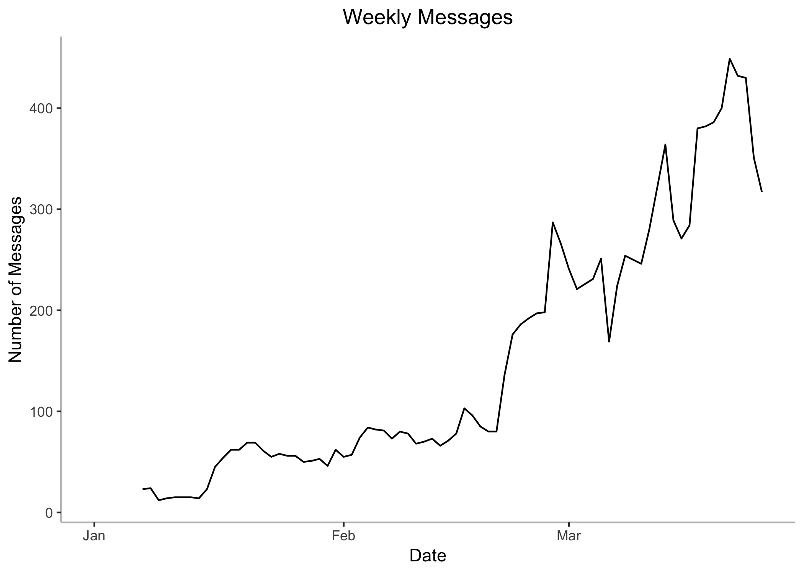
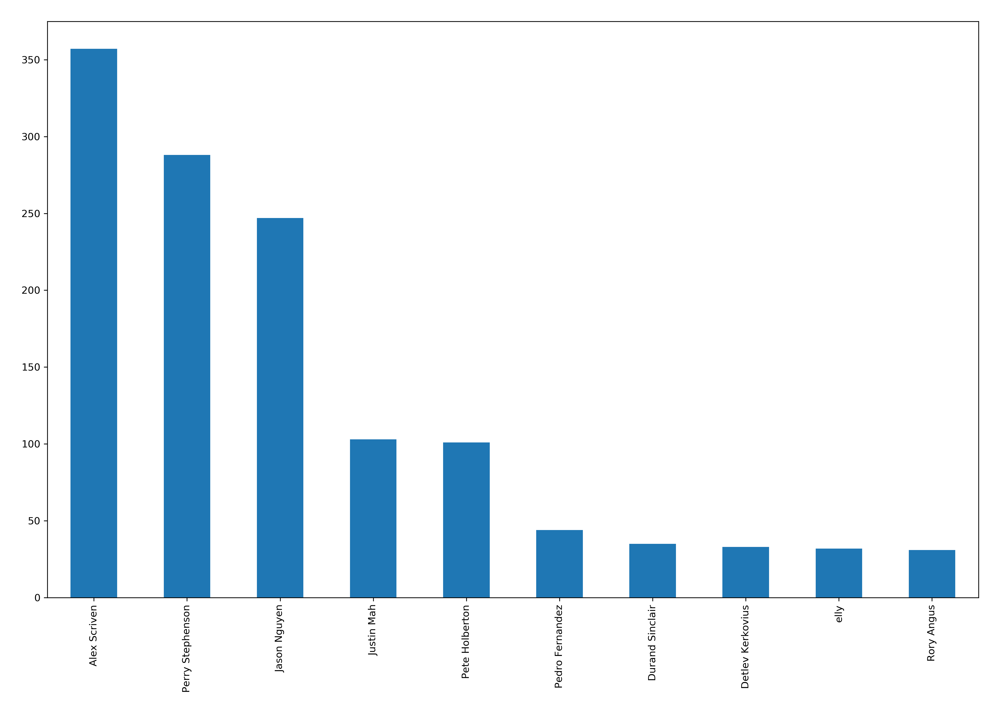
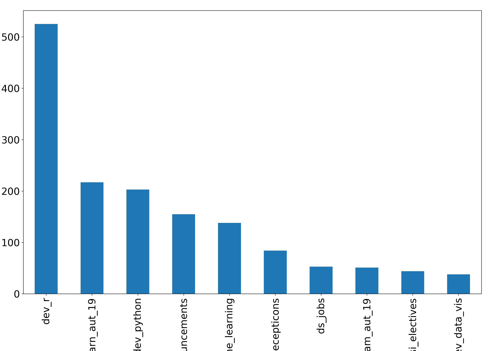

Slack Analysis
================

## Connect to Amazon RDS Slack database

A snapshot of Slack database has been configured as a cloud based
service on Amazon’s Relational Database Service. It can be accessed via
the following credentials. The database has been configured as
PostgreSQL relational database management system, so we are going to
need a compatible driver to connect to the remote cloud-based database
server. A list of 3 tables has been provided that have been created in
the slack database. We are going to extract all the 3 tables’ data from
database and bring in to R memory.

``` r
# Connect to remote DB
con <- dbConnect(drv = dbDriver('PostgreSQL'),
                 host     = 'mdsislack.clnutj7nhgyn.us-east-2.rds.amazonaws.com',
                 port     = 5432, 
                 user     = 'dsp2019',
                 password = 'oZkK6vgRbvDK',
                 dbname = 'mdsislack')

# Extract all tables
users <- dbGetQuery(con, "SELECT *
                          FROM users")
channels <- dbGetQuery(con, "SELECT *
                             FROM channels")
messages <- dbGetQuery(con, "SELECT *
                             FROM messages")

# Disconnect from remote DB
dbDisconnect(con)
```

## Create a local SQLite database

Optional Step: Instead to connecting to a cloud database, we can create
a local SQLite database as the tables are not too big and can be hosted
on a local storage. This step is optional and has been done as sometimes
the internet connection is patchy and the cloud database connections
times-out or gets disconnected. The SQLite database is saved as a file
on the storage and can be accessed later using the SQLite file
connection.

``` r
getwd()

# Create a new sqlite database and new connection to the database
slackdb <- dbConnect(RSQLite::SQLite(), "db/slackdb.sqlite")

# Create table & Append data
dbWriteTable(slackdb, "users", users)
dbWriteTable(slackdb, "channels", channels)
dbWriteTable(slackdb, "messages", messages)

# Verify the tables created
dbListTables(slackdb)

# Disconnect from local database
dbDisconnect(slackdb)
```

## Query local SQLite database

Connect to the SQLite database file created in the previous step using
the file identifier and SQLite database driver. All three tables that
are available on the cloud PostgreSQL database are now available locally
on the SQLite database. Let’s look at the number of records in each
table. All the slack message on the public channels are stored in the
‘messages’ table. The information about public channels is stored in
‘channels’ table and information about the users in stored in the
‘users’ table. The ‘messages’ can be linked/joined with the ‘channels’
and ‘users’ to append additional information to the ‘messages’ about
‘channels’ and ‘users’. Most common use-case would be to assign
human-friendly names to ‘id’ fields (channel\_id, user\_id) in the
‘messages’ to analyse ‘who’ sent message in ‘what’ channel.
Implementing some queries from class exercise to find out the user with
maximum posts/messages, channel with maximum posts/messages,user with
maximum posts/messages in a specific channel.

``` r
# Database driver
sqlite_driver <- dbDriver("SQLite")

# Database file
slackdb_file <- "db/slackdb.sqlite"

# Database connection
slackdb <- dbConnect(sqlite_driver, dbname = slackdb_file)

# List all the tables
dbListTables(slackdb)
```

    ## [1] "channels" "messages" "users"

``` r
# Number of users (including bots)
total_users <- 'SELECT count(*) AS users
                FROM users'

dbGetQuery(slackdb, total_users)
```

    ##   users
    ## 1   363

``` r
# Number of users (including archived)
total_channels <- 'SELECT count(*) AS channels
                   FROM channels'

dbGetQuery(slackdb, total_channels)
```

    ##   channels
    ## 1      128

``` r
# Number of posts
total_posts <- 'SELECT count(*) AS posts
                FROM messages'

dbGetQuery(slackdb, total_posts)
```

    ##   posts
    ## 1 28693

``` r
max_posts_user <- 'SELECT u.user_name
                   FROM messages m
                   LEFT JOIN users u
                       ON m.user_id = u.user_id
                   GROUP BY  1
                   ORDER BY  count(*) DESC LIMIT 1'

dbGetQuery(slackdb, max_posts_user)
```

    ##          user_name
    ## 1 Perry Stephenson

``` r
max_posts_channel <- 'SELECT c.channel_name
                      FROM messages m
                      LEFT JOIN channels c
                          ON m.channel_id = c.channel_id
                      GROUP BY  1
                      ORDER BY  count(*) DESC LIMIT 1'

dbGetQuery(slackdb, max_posts_channel)
```

    ##   channel_name
    ## 1        dev_r

``` r
max_posts_user_dam <- 'SELECT u.user_name
                       FROM messages m
                       INNER JOIN channels c
                           ON m.channel_id = c.channel_id
                       INNER JOIN users u
                           ON m.user_id = u.user_id
                       WHERE c.channel_name = \'mdsi_dam_aut_18\'
                       GROUP BY  1
                       ORDER BY  count(*) DESC LIMIT 1'

dbGetQuery(slackdb, max_posts_user_dam)
```

    ##      user_name
    ## 1 Alex Scriven

``` r
dbDisconnect(slackdb)
```

## Data Analysis in R

Let’s create a dataset from SQLite database that can be used to do some
analytics in R and Python. In the example below, we are extracting all
the slack messages from the beginning of this year (2019) and appending
the channels and users information to messages. Since the data in the
messages table has data only till March 2019, we can call the dataset as
‘all messages in last 90 days’. These type of datasets can be used to
analyse the activity of channels and users to classify them as
active/inactive channels or users. One of the use-cases could be to
analyse the seasonality of the activities to better manage the web
traffic/load. Another use-case could be to archive messages from any
inactive channel.

``` r
# Database driver
sqlite_driver <- dbDriver("SQLite")

# Database file
slackdb_file <- "db/slackdb.sqlite"

# Database connection
slackdb <- dbConnect(sqlite_driver, dbname = slackdb_file)

# List all the tables
dbListTables(slackdb)
```

    ## [1] "channels" "messages" "users"

``` r
# Bring data from SQLite database in to R
all_msgs_2019_query <- 'SELECT m.*,
                                 c.channel_name,
                                 c.channel_is_archived,
                                 u.user_name,
                                 u.user_is_bot
                        FROM messages m
                        LEFT JOIN channels c
                            ON m.channel_id = c.channel_id
                        LEFT JOIN users u
                            ON m.user_id = u.user_id
                        WHERE datetime( m.message_timestamp, \'unixepoch\' ) >= DATETIME(\'2019-01-01 00:00:00\')'

all_msgs_2019 <- dbGetQuery(slackdb, all_msgs_2019_query)

dbDisconnect(slackdb)
```

Convert the timestamp to a date format and for each day we are
caculating the total number of active users and messages posted. We are
also calculating a rolling weekly sum of users and messages to get an
aggregate view of weekly active users and messages being posted. Daily
numbers are usually more volatile and less predictable and hence we are
computing weekly aggregations as well, which will be less volatile and
more predictable.

``` r
setDT(all_msgs_2019)

# Convert unix timestamp to date
all_msgs_2019[, message_date := as.IDate(as.POSIXct(message_timestamp, origin = "1970-01-01", tz = "UTC"))]

# 90 days active users and messages counts
plot_data <- all_msgs_2019[, .(daily_msgs = .N, daily_users = uniqueN(user_id)), by = message_date]

# Calculate weekly active users and messages counts
setorderv(plot_data, "message_date")
plot_data[, weekly_msgs := rollsumr(daily_msgs, k = 7, fill = NA)]
plot_data[, weekly_users := rollsumr(daily_users, k = 7, fill = NA)]

# Plot Active Users (Weekly)
ggplot(plot_data, aes(x = as.IDate(message_date), y = weekly_users)) +
  geom_line() +
  theme(panel.background = element_blank(), axis.line = element_line(colour = "grey"), plot.title = element_text(hjust = 0.5)) +
  labs(x = "Date", y = "Number of Users") +
  ggtitle("Weekly Active Users")
```

<!-- -->

``` r
# Plot Active Users (Daily)
ggplot(plot_data, aes(x = as.IDate(message_date), y = daily_users)) +
  geom_line() +
  theme(panel.background = element_blank(), axis.line = element_line(colour = "grey"), plot.title = element_text(hjust = 0.5)) +
  labs(x = "Date", y = "Number of Users") +
  ggtitle("Daily Active Users")
```

<!-- -->

``` r
# Plot All Msgs (weekly)
ggplot(plot_data, aes(x = as.IDate(message_date), y = weekly_msgs)) +
  geom_line() +
  theme(panel.background = element_blank(), axis.line = element_line(colour = "grey"), plot.title = element_text(hjust = 0.5)) +
  labs(x = "Date", y = "Number of Messages") +
  ggtitle("Weekly Messages")
```

<!-- -->

``` r
# Plot All Msgs (daily)
ggplot(plot_data, aes(x = as.IDate(message_date), y = daily_msgs)) +
  geom_line() +
  theme(panel.background = element_blank(), axis.line = element_line(colour = "grey"), plot.title = element_text(hjust = 0.5)) +
  labs(x = "Date", y = "Number of Messages") +
  ggtitle("Daily Messages")
```

<!-- -->

## Data Analysis in Python

The same dataset that we created in R chunk, can be accessed in the
Python enironment using the ‘r’ object. Here we have created a
**pandas** dataframe from ‘r’ datatable. In the example below we are
trying to find the top 10 active users (excluding the bots) & channels.
Alternatively, we can look at the top 10 inactive users & channels. We
can even combine the two counts to look at the number of messages and
users in any channel.

``` python
import pandas as pd
import matplotlib.pyplot as plt

# Create pandas dataframe from R datatable
all_msgs_2019_df = pd.DataFrame(r.all_msgs_2019)

# Top 10 Users - 90 days
all_msgs_2019_df[all_msgs_2019_df["user_is_bot"] == 0]["user_name"].value_counts().nlargest(10).plot.bar()
plt.rcParams.update({'font.size': 20})
plt.tight_layout()
plt.show()

# Top 10 Channels - 90 days
```

<!-- -->

``` python
all_msgs_2019_df["channel_name"].value_counts().nlargest(10).plot.bar()
plt.rcParams.update({'font.size': 20})
plt.tight_layout()
```

    ## /Users/anuj/.virtualenvs/cs_proj/bin/python:1: UserWarning: Tight layout not applied. The bottom and top margins cannot be made large enough to accommodate all axes decorations.

``` python
plt.show()

# Details by channel (message count and unique users count)
```

<!-- -->

``` python
channel_details_df = all_msgs_2019_df.groupby(by='channel_name', as_index=False)["user_name"].agg({'msg_count': pd.Series.count, 'user_count': pd.Series.nunique})

channel_details_df.sort_values(by=['msg_count'], ascending=False).head()
```

    ##              channel_name  msg_count  user_count
    ## 7                   dev_r        525          19
    ## 22  mdsi_deeplearn_aut_19        217          14
    ## 6              dev_python        203          14
    ## 17     mdsi_announcements        155          36
    ## 4    dev_machine_learning        138          10

## Data Analysis in R

Just like ‘r’ objects can be accessed in Python environment, the objects
that were created in Python environment are accessible in R using the
‘py’ object. The only difference is the method of accessing the
objects. In R, Python objects are accessible using the ‘py’ followed by
‘$’ operator to access a particular nested object in ‘py’ object. In
Python, the ‘r’ objects can be accessed using a ‘.’ operator instead of
‘$’ operator. Using the insights created in the Python chunk, we can
write some rules to identify active/inactive channels and convert those
insights into actions. For example, a highly active channel was found
from the insights which has only one active user (a bot). Upon
inpsecting the channel messages, it appears that the channel was created
by a group of students for assignment purpose and they had setup a
reminder bot to post a reminder message everyday in that channel. While
the real users of the channel have gone inactive within that channel,
only the bot user is active currently and spamming it with reminder
messages. This channel can be clearly archived.

``` r
# Create R dataframe from Python dataframe
channel_details_dt <- py$channel_details_df
setDT(channel_details_dt)

# Order by lower user count but high message count
channel_details_dt[order(user_count, -msg_count)][1:10]
```

    ##              channel_name msg_count user_count
    ##  1:      36100decepticons        84          1
    ##  2:            free-stuff         1          1
    ##  3:            oth_humour         1          1
    ##  4:       fliparound_chat        31          2
    ##  5:          dev_datasets        12          2
    ##  6:         ds_hackathons         5          2
    ##  7:   mdsi_cicaround_help         4          2
    ##  8:    events-of-interest         2          2
    ##  9:            oth_random         2          2
    ## 10: mdsi_deeplearn_spr_17        32          3

``` r
all_msgs_2019[channel_name == "36100decepticons", list(user_id, message_text, channel_is_archived)][1:10]
```

    ##       user_id          message_text channel_is_archived
    ##  1: USLACKBOT Reminder: write data.                   0
    ##  2: USLACKBOT Reminder: write data.                   0
    ##  3: USLACKBOT Reminder: write data.                   0
    ##  4: USLACKBOT Reminder: write data.                   0
    ##  5: USLACKBOT Reminder: write data.                   0
    ##  6: USLACKBOT Reminder: write data.                   0
    ##  7: USLACKBOT Reminder: write data.                   0
    ##  8: USLACKBOT Reminder: write data.                   0
    ##  9: USLACKBOT Reminder: write data.                   0
    ## 10: USLACKBOT Reminder: write data.                   0
