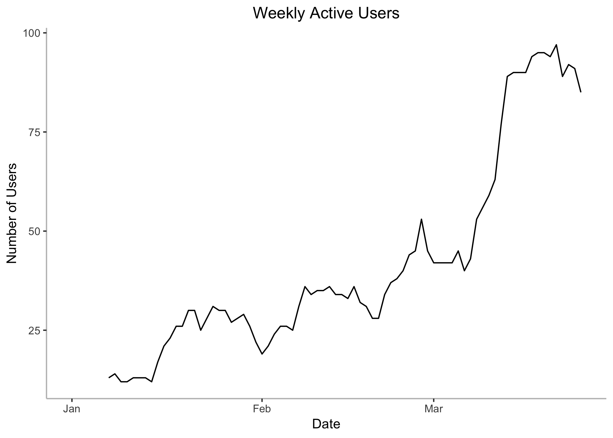
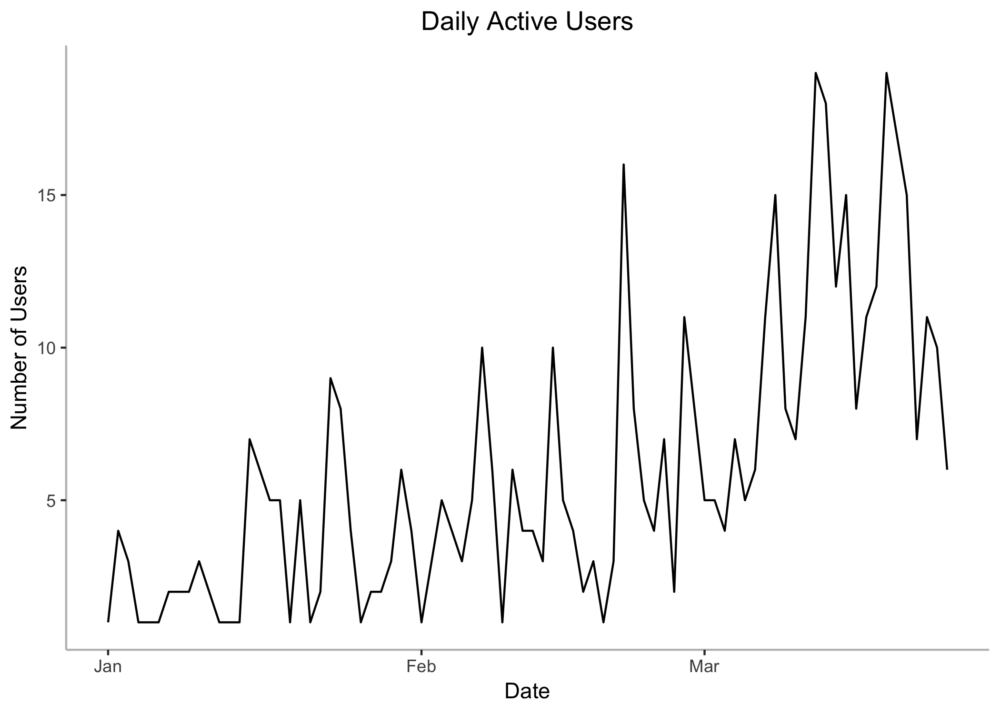
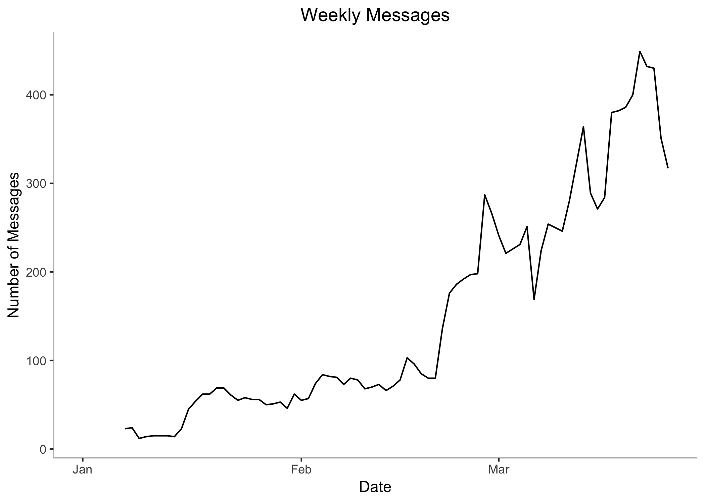
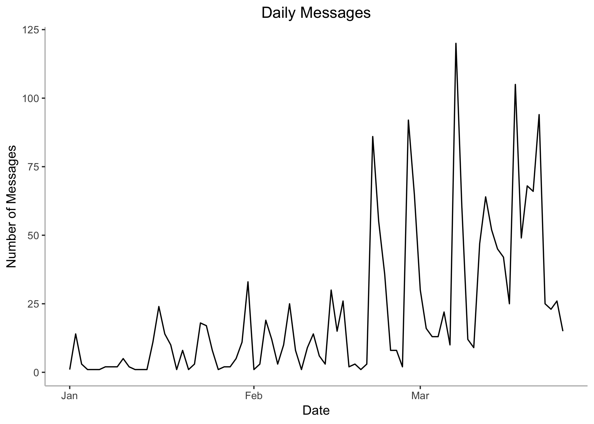
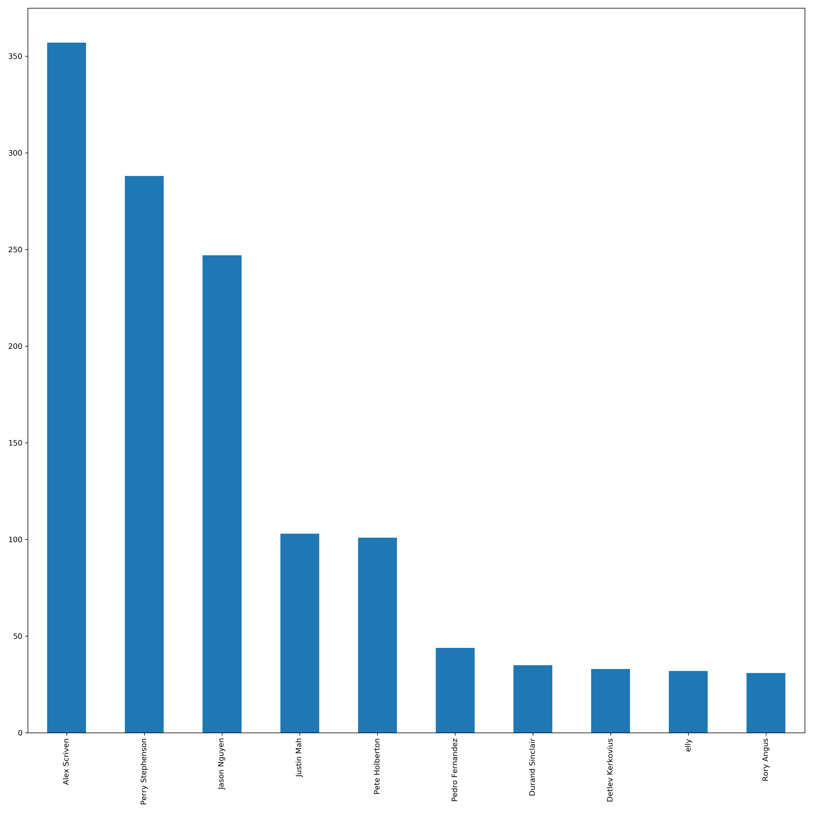
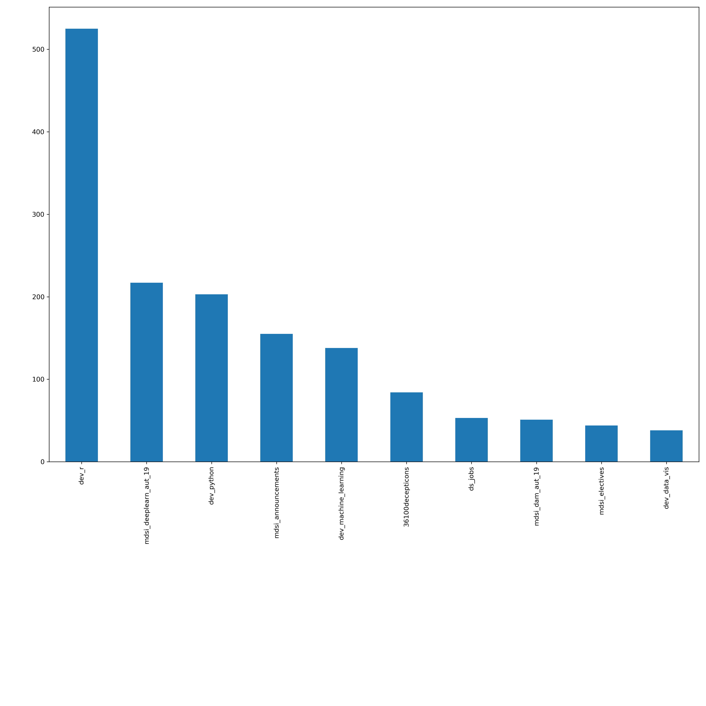

Slack Analysis
================

## Connect to Amazon RDS Slack database

``` r
# Connect to remote DB
con <- dbConnect(drv = dbDriver('PostgreSQL'),
                 host     = 'mdsislack.clnutj7nhgyn.us-east-2.rds.amazonaws.com',
                 port     = 5432, 
                 user     = 'dsp2019',
                 password = 'oZkK6vgRbvDK',
                 dbname = 'mdsislack')

# Extract all tables
users <- dbGetQuery(con, "select * from users")
channels <- dbGetQuery(con, "select * from channels")
messages <- dbGetQuery(con, "select * from messages")

# Disconnect from remote DB
dbDisconnect(con)
```

## Create a local SQLite database

``` r
getwd()

# Create a new sqlite database and new connection to the database
slackdb <- dbConnect(RSQLite::SQLite(), "db/slackdb.sqlite")

# Create table & Append data
dbWriteTable(slackdb, "users", users)
dbWriteTable(slackdb, "channels", channels)
dbWriteTable(slackdb, "messages", messages)

# Verify the tables created
dbListTables(slackdb)

# Disconnect from local database
dbDisconnect(slackdb)
```

## Query local SQLite database

``` r
# Database driver
sqlite_driver <- dbDriver("SQLite")

# Database file
slackdb_file <- "db/slackdb.sqlite"

# Database connection
slackdb <- dbConnect(sqlite_driver, dbname = slackdb_file)

# List all the tables
dbListTables(slackdb)
```

    ## [1] "channels" "messages" "users"

``` r
# Number of users (including bots)
total_users <- 'select count(*) as users
                from
                users
                '

dbGetQuery(slackdb, total_users)
```

    ##   users
    ## 1   363

``` r
# Number of users (including archived)
total_channels <- 'select count(*) as channels
                from
                channels
                '

dbGetQuery(slackdb, total_channels)
```

    ##   channels
    ## 1      128

``` r
# Number of posts
total_posts <- 'select count(*) as posts
                from
                messages
                '

dbGetQuery(slackdb, total_posts)
```

    ##   posts
    ## 1 28693

``` r
max_posts_user <- 'select u.user_name
                    from
                    messages m
                    inner join users u
                    on m.user_id = u.user_id
                    group by 1
                    order by count(*) desc
                    limit 1'

dbGetQuery(slackdb, max_posts_user)
```

    ##          user_name
    ## 1 Perry Stephenson

``` r
max_posts_channel <- 'select c.channel_name
                      from
                      messages m
                      inner join channels c
                      on m.channel_id = c.channel_id
                      group by 1
                      order by count(*) desc
                      limit 1'

dbGetQuery(slackdb, max_posts_channel)
```

    ##   channel_name
    ## 1        dev_r

``` r
max_posts_user_dam <- 'select u.user_name
                      from
                      messages m
                      inner join channels c on m.channel_id = c.channel_id
                      inner join users u on m.user_id = u.user_id
                      where c.channel_name = \'mdsi_dam_aut_18\'
                      group by 1
                      order by count(*) desc
                      limit 1'

dbGetQuery(slackdb, max_posts_user_dam)
```

    ##      user_name
    ## 1 Alex Scriven

``` r
dbDisconnect(slackdb)
```

## Data Analysis in R

``` r
# Database driver
sqlite_driver <- dbDriver("SQLite")

# Database file
slackdb_file <- "db/slackdb.sqlite"

# Database connection
slackdb <- dbConnect(sqlite_driver, dbname = slackdb_file)

# List all the tables
dbListTables(slackdb)
```

    ## [1] "channels" "messages" "users"

``` r
# Bring data from SQLite database in to R
all_msgs_2019_query <- 'select m.*, c.channel_name, c.channel_is_archived, u.user_name, u.user_is_bot
                        from
                        messages m
                        left join channels c on m.channel_id = c.channel_id
                        left join users u on m.user_id = u.user_id
                        WHERE datetime( m.message_timestamp, \'unixepoch\' ) >=  DATETIME(\'2019-01-01 00:00:00\')'

all_msgs_2019 <- dbGetQuery(slackdb, all_msgs_2019_query)

dbDisconnect(slackdb)

# 90 days active users and messages counts
setDT(all_msgs_2019)
all_msgs_2019[, .(msg_count = .N, user_count = uniqueN(user_id)), by = channel_id]
```

    ##     channel_id msg_count user_count
    ##  1:  C5SQ1Q1UH        32          3
    ##  2:  C1E873E2E        53         10
    ##  3:  C1924SRPG       525         19
    ##  4:  CGQREKSBG       217         14
    ##  5:  C1NDAKX39       138         10
    ##  6:  C1CHS0P45        38          9
    ##  7:  C6HMFCW9K        84          1
    ##  8:  CGV3RUZ2S        22          6
    ##  9:  CH96CFF8E        22          3
    ## 10:  C192CUEH5       203         14
    ## 11:  CGRPA1FQS         9          6
    ## 12:  C18SWDACD       155         36
    ## 13:  C1ATW6P99        14          5
    ## 14:  CGV3BFTC1        17          3
    ## 15:  CGCFSE3FD        29         12
    ## 16:  C2L4ZHVHQ        12          2
    ## 17:  C1U4T4GCR        44         16
    ## 18:  C6YT8EK9S        31          2
    ## 19:  CGQ64P9QS        51         10
    ## 20:  CH8QYP7UP        10          6
    ## 21:  CH36QTYDA        22          4
    ## 22:  CGUV9MGUQ        18          7
    ## 23:  C1AR0J1K6        20          9
    ## 24:  C4H18MG0K         8          5
    ## 25:  C4P5NMR0D         6          5
    ## 26:  CD9BZBBDL         3          3
    ## 27:  C191P7JE6         5          5
    ## 28:  C5D6KT798         2          2
    ## 29:  C192JHDND         5          2
    ## 30:  C2E3KFE6P         1          1
    ## 31:  C4RLFGL73         4          2
    ## 32:  CC9564N68         2          2
    ## 33:  CDYTCTC0N         1          1
    ##     channel_id msg_count user_count

``` r
all_msgs_2019[, message_date:= as.IDate(as.POSIXct(message_timestamp,origin="1970-01-01",tz="UTC"))]

all_msgs_2019[, week:= cut.Date(message_date, breaks="week")]

plot_data <- all_msgs_2019[, .(daily_msgs = .N, daily_users = uniqueN(user_id)), by = message_date]

setorderv(plot_data, "message_date")
plot_data[, weekly_msgs := rollsumr(daily_msgs, k = 7, fill = NA)]
plot_data[, weekly_users := rollsumr(daily_users, k = 7, fill = NA)]

# Plot Active Users (Weekly)
ggplot(plot_data, aes(x=as.IDate(message_date), y= weekly_users)) +
  geom_line() + 
  theme(panel.background = element_blank(), axis.line = element_line(colour = "grey"), plot.title = element_text(hjust = 0.5))+
  labs(x = 'Date', y = 'Number of Users') +
  ggtitle("Weekly Active Users")
```

<!-- -->

``` r
# Plot Active Users (Daily)
ggplot(plot_data, aes(x=as.IDate(message_date), y= daily_users)) +
  geom_line() + 
  theme(panel.background = element_blank(), axis.line = element_line(colour = "grey"), plot.title = element_text(hjust = 0.5))+
  labs(x = 'Date', y = 'Number of Users') +
  ggtitle("Daily Active Users")
```

<!-- -->

``` r
# Plot All Msgs (weekly)
ggplot(plot_data, aes(x=as.IDate(message_date), y= weekly_msgs)) +
  geom_line() + 
  theme(panel.background = element_blank(), axis.line = element_line(colour = "grey"), plot.title = element_text(hjust = 0.5))+
  labs(x = 'Date', y = 'Number of Messages') +
  ggtitle("Weekly Messages")
```

<!-- -->

``` r
# Plot All Msgs (daily)
ggplot(plot_data, aes(x=as.IDate(message_date), y= daily_msgs)) +
  geom_line() + 
  theme(panel.background = element_blank(), axis.line = element_line(colour = "grey"), plot.title = element_text(hjust = 0.5))+
  labs(x = 'Date', y = 'Number of Messages') +
  ggtitle("Daily Messages")
```

<!-- -->

``` r
all_msgs_2019[, list(channel_id, user_id, message_timestamp)]
```

    ##       channel_id   user_id message_timestamp
    ##    1:  C5SQ1Q1UH U191LC7S4        1551413778
    ##    2:  C1E873E2E U191LC7S4        1552603286
    ##    3:  C1924SRPG U4ELUPRDY        1551341629
    ##    4:  CGQREKSBG U4TE2KTPF        1552355687
    ##    5:  C1NDAKX39 U4TE2KTPF        1549927629
    ##   ---                                       
    ## 1799:  C1924SRPG U18TT99MY        1550800142
    ## 1800:  C1924SRPG U9U7AC9QA        1551249299
    ## 1801:  C18SWDACD U18TT99MY        1551955578
    ## 1802:  C1924SRPG U18TT99MY        1550799158
    ## 1803:  C1CHS0P45 U4TE2KTPF        1552891100

``` r
all_msgs_2019[, .(msg_count = .N, user_count = uniqueN(user_id)), by = channel_id]
```

    ##     channel_id msg_count user_count
    ##  1:  C5SQ1Q1UH        32          3
    ##  2:  C1E873E2E        53         10
    ##  3:  C1924SRPG       525         19
    ##  4:  CGQREKSBG       217         14
    ##  5:  C1NDAKX39       138         10
    ##  6:  C1CHS0P45        38          9
    ##  7:  C6HMFCW9K        84          1
    ##  8:  CGV3RUZ2S        22          6
    ##  9:  CH96CFF8E        22          3
    ## 10:  C192CUEH5       203         14
    ## 11:  CGRPA1FQS         9          6
    ## 12:  C18SWDACD       155         36
    ## 13:  C1ATW6P99        14          5
    ## 14:  CGV3BFTC1        17          3
    ## 15:  CGCFSE3FD        29         12
    ## 16:  C2L4ZHVHQ        12          2
    ## 17:  C1U4T4GCR        44         16
    ## 18:  C6YT8EK9S        31          2
    ## 19:  CGQ64P9QS        51         10
    ## 20:  CH8QYP7UP        10          6
    ## 21:  CH36QTYDA        22          4
    ## 22:  CGUV9MGUQ        18          7
    ## 23:  C1AR0J1K6        20          9
    ## 24:  C4H18MG0K         8          5
    ## 25:  C4P5NMR0D         6          5
    ## 26:  CD9BZBBDL         3          3
    ## 27:  C191P7JE6         5          5
    ## 28:  C5D6KT798         2          2
    ## 29:  C192JHDND         5          2
    ## 30:  C2E3KFE6P         1          1
    ## 31:  C4RLFGL73         4          2
    ## 32:  CC9564N68         2          2
    ## 33:  CDYTCTC0N         1          1
    ##     channel_id msg_count user_count

## Data Analysis in Python

``` python
import pandas as pd
import matplotlib.pyplot as plt


# Data Frame
all_msgs_2019_df = pd.DataFrame(r.all_msgs_2019)

# Top 10 Users - 90 days
all_msgs_2019_df[all_msgs_2019_df["user_name"] != 'NA']["user_name"].value_counts().nlargest(10).plot.bar()
plt.tight_layout()
plt.show()

# Top 10 Channels - 90 days
```

<!-- -->

``` python
all_msgs_2019_df["channel_name"].value_counts().nlargest(10).plot.bar()
plt.tight_layout()
```

    ## /Users/anuj/.virtualenvs/cs_proj/bin/python:1: UserWarning: Tight layout not applied. The bottom and top margins cannot be made large enough to accommodate all axes decorations.

``` python
plt.show()

# Details by channel (message count and unique users count)
```

<!-- -->

``` python
channel_details_df = all_msgs_2019_df.groupby(by='channel_name', as_index=False)["user_name"].agg({'msg_count': pd.Series.count, 'user_count': pd.Series.nunique})

channel_details_df.head()
```

    ##            channel_name  msg_count  user_count
    ## 0      36100decepticons         84           1
    ## 1               avacado         22           4
    ## 2          dev_data_vis         38           9
    ## 3          dev_datasets         12           2
    ## 4  dev_machine_learning        138          10

## Data Analysis in R

``` r
channel_details_dt <- py$channel_details_df
setDT(channel_details_dt)

channel_details_dt[order(-msg_count)][1:10]
```

    ##              channel_name msg_count user_count
    ##  1:                 dev_r       525         19
    ##  2: mdsi_deeplearn_aut_19       217         14
    ##  3:            dev_python       203         14
    ##  4:    mdsi_announcements       155         36
    ##  5:  dev_machine_learning       138         10
    ##  6:      36100decepticons        84          1
    ##  7:               ds_jobs        53         10
    ##  8:       mdsi_dam_aut_19        51          9
    ##  9:        mdsi_electives        44         16
    ## 10:          dev_data_vis        38          9
